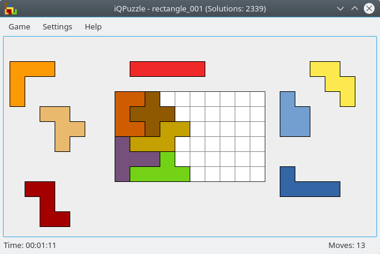

# iQPuzzle
iQPuzzle is a diverting I.Q. challenging pentomino puzzle. The puzzle pieces are pentominoes, and there are more than 360 different board shapes to fill with them.

## Installation
* [Build for Windows, macOS (untested) or ReactOS](https://codeberg.org/ElTh0r0/iqpuzzle/releases/latest)
* [AppImage](https://codeberg.org/ElTh0r0/iqpuzzle/releases/latest)
* [Flatpak](https://flathub.org/apps/details/com.github.elth0r0.iqpuzzle)
* [Ubuntu PPA](https://launchpad.net/~elthoro/+archive/iqpuzzle)
* [Builds for Debian, Fedora, openSUSE, SLE](http://software.opensuse.org/download.html?project=home%3AElThoro&package=iqpuzzle)
* [Arch AUR](https://aur.archlinux.org/packages/iqpuzzle/)
* [Build for Mageia Cauldron](https://madb.mageialinux-online.org/show?distribution=cauldron&architecture=x86_64&graphical=0&rpm=iqpuzzle)
* [Build for OS/2](http://www.ecsoft2.org/iqpuzzle)
* [FreeBSD Ports](https://www.freshports.org/games/iqpuzzle) / [DPorts](https://github.com/DragonFlyBSD/DPorts/tree/master/games/iqpuzzle)

## Game controls
The game is controlled using the mouse. By default, puzzle pieces are moved using the left mouse button and drag-and-drop. The mouse wheel can be used to rotate pieces and the right mouse button can be used to flip them.

These settings can be changed via the _'Settings → Configure iQPuzzle'_ menu.

## Help translating
New translations and corrections are highly welcome! You can either fork the source code, make your changes and then create a pull request or you can participate on [translate.codeberg.org](https://translate.codeberg.org/engage/iqpuzzle/).

Additionally see [this page](https://codeberg.org/ElTh0r0/iqpuzzle/issues/8).

## Create your own level
You can find a manual for creating your own levels here. Feel free to submit a pull request on Codeberg and your level could be included in the next release!
Manual for creating own levels can be found in the wiki: https://codeberg.org/ElTh0r0/iqpuzzle/wiki
